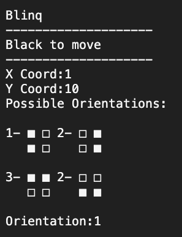

# pfl-blinq

## Introduction

This is the readme file for the second project on the Functional and Logical Programming course in the final year of the Bachelors at FEUP. The game developed is BLINQ, a game where the players have to put pieces to connect colors to the extreme sides of the board.

+ Project Namge: pfl-blinq
+ Participants:
  + Rubem Neto (up202207086) - Contribution (50%)
  + Diogo Goiana (up202207086) - Contribution (50%)
+ Group: 01
+ TP Class: 3LEIC04

There are no necessary extensions or different fonts in this game.

## Installation and Execution

There are two different ways to install this game, first by cloning the repository and the second is by downloading via the zip file provided in the project submission.

### Clone repository

1. clone the repository:
```bash
git clone https://github.com/DGoiana/pfl-blinq/
```
2. change to src folder:
```bash
cd src/
```
3. open the sicstus interpreter:
```bash
sicsuts
```
4. import the game:
```bash
consult(game).
```
5. execute the game predicate:
```bash
play.
```

### Via Project Submission

1. unzip the game folder:
```bash
unzip PFL_TP2_T04_Blinq_1.zip
```
2. change to src folder:
```bash
cd PFL_TP2_T04_Blinq_1/
```
2. change to src folder:
```bash
cd src/
```
3. open the sicstus interpreter:
```bash
sicsuts
```
4. import the game:
```bash
consult(game).
```
5. execute the game predicate:
```bash
play.
```


## Description of the game

BLINQ was developed in 2020 by Néstor Romeral Andrés and published by nestorgames.

BLINQ is a two player connection game where players have coloured squared tiles and they have to connect the two sides of the board with their color.

There is also a simple stacking rule, where the players can put squares above 2x2 plataform of pieces.


This image is from the physical version of the game, where the stacking rule is clearly visible. However, as our game is 2d it was a challenge to make this work.

The main version of the game has a board of 5x5 pieces with a total of 54 pieces (where the players are given 27 pieces).

There is also a neutral piece in the middle at the beginning of the game, this piece is the following format:


The game game ends when one of the players has no way to complete the board (losing the game), or, at the end of their turn, one of the players has connected the two sides of their colour (winning the game). The path connecting the two sides of the board must be continuous along the surfaces of the same colours when viewed from above.

If the players run out of pieces and a connection has not been made, the game ends in a draw.

The official rule book is available at this [link](https://nestorgames.com/rulebooks/BLINQ_A5_EN.pdf).

More information about the game in [link](https://boardgamegeek.com/boardgame/271266/blinq).


## Considerations for game extensions

There are two possible big considerations for game extensions. The first is changing the position of the neutral piece in the beginning of the game and the second is supporting dynamic board sizes.

For the first, we did not consider it being a good idea, since it almost just be move from a player and it would really change the dynamic of the game in a desirable manner. Therefore, we chose not to integrate this feature.

On the other hand, we thought that a dynamic board would add some really interesting dynamics to the game and we were right, it is almost a different (but not less fun) game to playe, with a different board size.

In conclusion we have adopted the dynamic board sizes but chose not to implement the different positions for the neutral piece, as we thought it would be really good.

## Game Logic

This section summarizes the implementation of the game and explains its inner workings.

### Game Configuration Representation

The game configuration is defined by to different components, the Board Size and the Game Type.

The board size, as on its name, defines the size of the board where the game will be played. The board size needs to be in the range from 3 to 10. 

We chose this range because, it not possible to have a board with a size less than 3x3 and boards with size bigger than 10x10 don't look nice in the terminal environment.

There are 4 game types support by the game: Bot-Bot,Bot-Player,Player-Bot and Player-Player. As described on their names, for each player they can be either a user (Player) or a Bot (Bot).

After a Game Type which contains a bot is chosen, the user must choose the bot's difficulty. There are 2 possible difficulties for a bot, there is the hard bot and the easy bot.

The easy bot just chooses moves randomly without any regards to the current state of the game. 

The hard bot analyzes the current state of the game and chooses a move according to its position. When choosing a new move, the bot priorites to aspects, which move would increase the biggest sequence of their pieces and if the would get closer to the other size of the board.

After the configuration is set, the game starts.

### Internal Game State Representation

The game state is the main component of the game, it holds the most essential information about the game at every moment.


It is composed by the state of the board (CurrentBoard), the player which is moving (CurrentPlayer), information about the type of player and its pieces (PlayerType-Pieces), the maximum layer of the board (MaxLayer) and the longest sequences for black and white pieces (LongestSequenceWhite-LongestSequenceBlack).

The MaxLayer and the longest sequences for black and white are two components which are not directly useful the user but are essential for the game to work. First, MaxLayer is used to determine which is the maximum layer to test when trying to find 2x2 plataforms for the player to move. In the other hand, the Longest Sequence is useful for the hard bot to determine which is the current longest sequence and it also contributes for the algorithms effiency.

### Move Representation

A move is responsible for changing the game's current state, by changing the state of the board, current player, current pieces and maybe the longest sequence or max layer.

When choosing a move, the user must provide its coordinates and its orientation, since there are 4 possible orientations for a given piece in the game:

```
% left
/* bw */
/* bw */

% right
/* wb */
/* wb */

% up
/* bb */
/* ww */

% down
/* ww */
/* bb */
```

The coordinates of the board starts in (1,1) on the left bottom corner, but this is only for the user. In the code, the coordinates gets converted to a board that starts on (0,0).

It is also important to note, that the X coordinates grows from left to right and the Y coordinate grows from down to up.

The game is based on a finite number of possible moves, therefore there is a representation for the possible moves. The possible moves for empty squares are represented as a '*' and the possible moves above a plataform are represented differently for white and black squares. For the white pieces is a 'W' and for the black pieces it's a 'B'.

### User Interaction

User interaction on this game is done by the player choosing a number in a range of possibilites, from the games configuration to the choice of a move.

Users are responsible to choose the game's configuration at the beginning and, depending on the mode that they chose, have to choose their moves.


In the game, the user must choose the coordinates of the piece they want to place and then its orientation. Based on the possibility of the move, they are shown the next game state or a prompt to choose another move.



### End Game

According to the game's rules, the game ends when either a player connects the two sides of the board with their color or when there is no possible move to be done.

## Conclusions

This project accomplishes the task given, as it is an implementation of the game Blinq. There were some difficulties in the development, for example with the algorithm to determine the best move for the hard bot or how to evaluate the possible moves for a given board state.

There is some work to be done for the future. Mainly in user interaction, since prompting the user for the coordinates can be sometimes boring. There could be a better system to preview the next move.

In conclusion, the project was overall satisfying and it accomplishes its goal.

## Bibliography

[Sicstus documentation](https://sicstus.sics.se/sicstus/docs/latest4/html/sicstus.html/) \
[Blinq Rule Book](https://nestorgames.com/rulebooks/BLINQ_A5_EN.pdf) \
[BoardGameGeek Blinq's Page](https://boardgamegeek.com/boardgame/271266/blinq)

